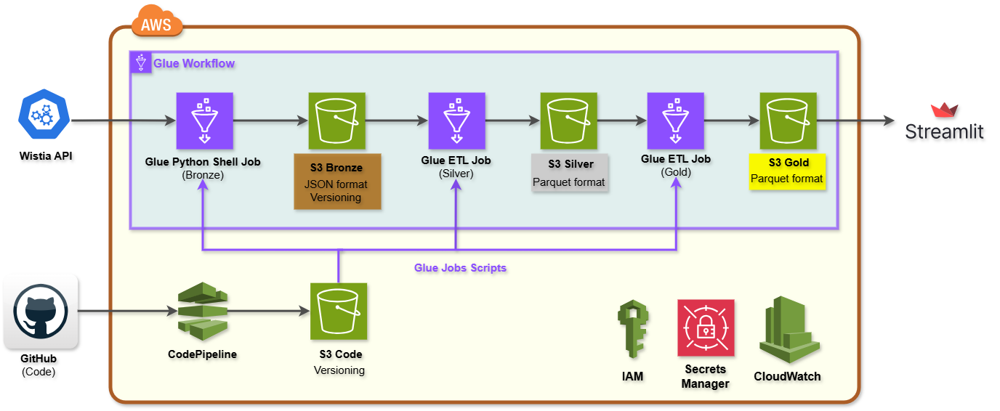

# Project 4: Wistia Video Analytics????

This project implements a production-ready data pipeline for analyzing video engagement from the **Wistia Stats API**. It ingests, transforms, aggregates, and visualizes data using **AWS Glue**, **S3**, **Python/PySpark**, and **Streamlit**, following a **Bronze–Silver–Gold architecture**.

## Business Objective

* Collect media-level, engagement-level, and visitor-level data
* Automate data processing and reporting
* Generate insights to improve marketing strategies

## Architecture

## Key Steps

### Bronze Layer

* Ingest raw JSON data from Wistia API
* Handle pagination and incremental pulls
* Store in **S3 Bronze bucket** for auditability

### Silver Layer

* Clean, standardize, and deduplicate data
* Convert to **Parquet**
* Store in **S3 Silver bucket**

### Gold Layer

* Aggregate KPIs and metrics
* Prepare **dashboard-ready datasets**
* Store in **S3 Gold bucket**

### Visualization

* Streamlit dashboards read Gold layer Parquet files
* Interactive charts, filters, and KPI cards

### Orchestration & CI/CD

* **AWS Glue Workflow** manages dependencies and scheduling
* **GitHub + AWS CodePipeline** automates deployment
* CloudWatch logs for monitoring and error tracking

## Outcome

* Fully automated, production-ready pipeline
* Secure, scalable, and cost-efficient
* Generates actionable marketing insights

---

## Repository

* GitHub: [https://github.com/Hadi2468/ELT_Project4](https://github.com/Hadi2468/ELT_Project4)

